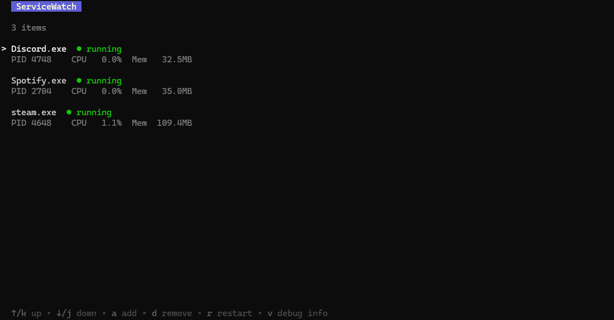
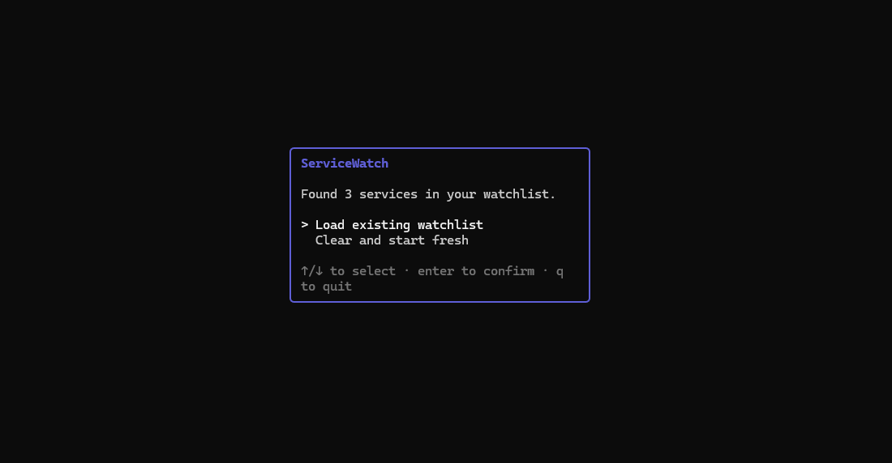
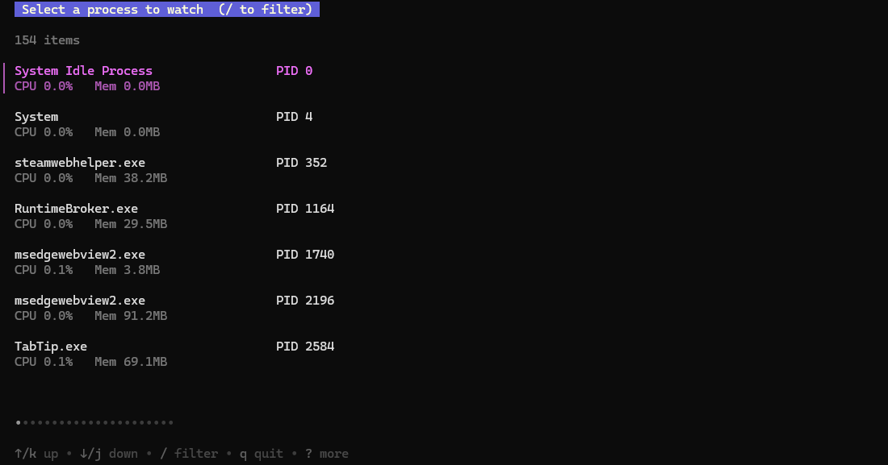

# ServiceWatch


A cross-platform process monitor with auto-restart capabilities, a terminal UI dashboard, and a headless daemon mode.



## Features

- **TUI Dashboard** — Real-time process status with live CPU, memory, and PID tracking
- **Headless Mode** — Run as a background daemon for unattended monitoring
- **Auto-Restart** — Automatically restart crashed processes with configurable cooldowns and retry limits
- **PID Pinning** — Tracks processes by PID with name-based fallback for reliable liveness detection
- **Process Picker** — Browse and filter all running system processes to add to your watchlist
- **Structured Logging** — JSONL event log with automatic rotation (10MB max, 5 backups, 7-day retention)
- **Cross-Platform** — Works on Windows, Linux, and macOS

## Quick Start

### Prerequisites

- Go 1.25+ (to build from source)

### Build & Run

```bash
git clone https://github.com/ethan-mdev/service-watch.git
cd service-watch
go build -o service-watch .
```

Launch the TUI:

```bash
./service-watch
```

Or run in headless/daemon mode:

```bash
./service-watch --headless
```

> **Note:** Headless mode requires an existing watchlist. Run the TUI first to set one up.

## Usage

### TUI Controls

| Key | Action |
|-----|--------|
| `a` | Add a process to the watchlist |
| `d` | Remove selected process (with confirmation) |
| `r` | Restart selected process (with confirmation) |
| `v` | Toggle debug info panel |
| `q` | Quit |

On startup, the TUI will prompt you to load an existing watchlist or start fresh.



### Adding a Process

Press `a` to open the process picker, which lists all running system processes. Use `/` to filter. Select a process and configure its restart command, max retries, cooldown, and auto-restart setting.



### Configuration

`config.yaml` is created automatically on first run with sensible defaults:

```yaml
metricsPort: 9090
pollIntervalSecs: 5
restartVerifyDelaySecs: 3
logLevel: info              # info | debug
```

| Option | Description | Default |
|--------|-------------|---------|
| `metricsPort` | Port for metrics endpoint (planned) | `9090` |
| `pollIntervalSecs` | How often to check process status | `5` |
| `restartVerifyDelaySecs` | Delay after restart before verifying health | `3` |
| `logLevel` | Log verbosity (`info` or `debug`) | `info` |

### Watchlist

The watchlist is stored in `watchlist.json` next to the executable. Each entry tracks:

- Process name and restart command
- Auto-restart toggle
- Max retries and cooldown period
- Restart/failure counters and last restart timestamp

### Logs

Events are logged to `logs/events.jsonl` in structured JSON format. Log rotation is automatic.

## Project Structure

```
service-watch/
├── main.go                        # Entry point, CLI flags, wiring
├── config.yaml                    # Runtime configuration
├── watchlist.json                 # Persisted watchlist
├── screenshots/                   # Screenshots for README 
└── internal/
    ├── config/config.go           # Config loading and validation
    ├── core/
    │   ├── types.go               # Core data types
    │   └── contracts.go           # Interfaces (ProcessManager, WatchlistManager)
    ├── logger/logger.go           # JSONL logger with rotation
    ├── monitor/watcher.go         # Polling loop, liveness checks, auto-restart
    ├── process/manager.go         # OS process operations via gopsutil
    ├── storage/watchlist.go       # JSON-backed watchlist persistence
    └── tui/
        ├── app.go                 # Bubble Tea bootstrap
        ├── model.go               # Top-level TUI model and routing
        └── views/
            ├── welcome.go         # Startup screen
            ├── list.go            # Main dashboard view
            └── picker.go          # Process picker and add form
```

## Roadmap

### v2.1 — Webhook Notifications
Discord/Slack webhook alerts for process failures and restarts.

### v2.2 — Prometheus Metrics Endpoint
Expose process and host metrics at `/metrics` for scraping.

### v2.3 — TUI Log Viewer
Tail and filter structured logs directly within the TUI.

### v2.4 — Config Hot-Reload
Pick up `config.yaml` changes without restarting the application.

### v3 — Advanced TUI
Multi-stage failure policies, process grouping/tagging, and real-time/historical charts for process resource data.

## License

MIT License — see [LICENSE](LICENSE) for details.
